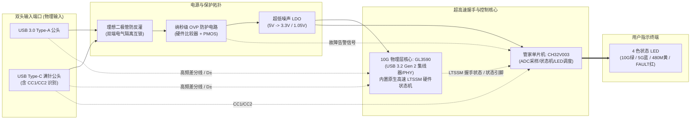
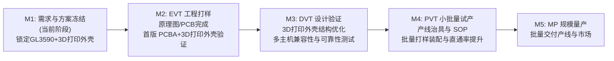

# USB 3.2 10G 双头极速接口测试器 - 产品需求文档 (PRD)

| 文档版本 | 发布日期 | 作者 / 架构师 | 状态 | 适用阶段 |
| :--- | :--- | :--- | :--- | :--- |
| **V1.1** | 2026-10-09 | 硬件系统研发组 | 评审中 (In Review) | EVT / DVT 研发立项 |

---

## 1. 产品背景与目标 (Context & Objectives)

### 1.1 研发背景与行业痛点
在 PC 主板制造、整机组装、工控设备、拓展坞制造、QC 质检及售后返修产线上，USB 接口（尤其是高速 USB 3.2 接口）的测试是必不可少的出厂检验环节。然而目前行业采用的简易测试手段与高端仪器普遍存在以下突出痛点：

1. **简易物理通断测试板（严重漏检高频与协议故障）**：
   - 市售几元至十几元的通断灯板仅利用 LED 串联电阻测试 VBUS、GND、CC 及低速 D+/D- 的直流物理通断，无法评估差分阻抗、高频信号衰减以及协议协商状态。
   - 生产中常见的“虚焊”、“阻抗失配”、“容阻偏位”、“差分线断单根”等物理缺陷，在简易板上指示灯照样点亮，但真实插入 10G/5G 高速设备时却握手失败或严重降速，导致不良品直接流出产线。
2. **专业协议分析仪/示波器（设备极其昂贵、工位无法普及）**：
   - 示波器与专业协议仪单套价格数万至数十万元，操作复杂，仅适用于研发实验室深入 Debug，无法在劳动密集型制造产线进行工位全面覆盖。
   - 市面上现有的极少数专用硬件测试器（如市售某款 93 元产品）性价比低，接口形态单一（单 Type-A 或单 Type-C），且缺乏全面的过压与异常电气保护机制。

### 1.2 产品定位与核心目标
**USB 3.2 10G Dual-Port Quick Tester（USB 3.2 10G 双头极速接口测试器）** 是一款专为工厂产线、品质质检、售后快修与硬件实验室打造的**免电脑驱动、纯硬件级、即插即判**的超低成本智能测试治具：

- **极速硬件级响应**：基于硬件级链路训练状态机（LTSSM），测试响应时间 **≤ 1.0 秒**，无需连接上位机软件或依赖驱动，插入即可瞬时判定。
- **全接口覆盖**：集成 **USB 3.0 Type-A 公头** 与 **Type-C 满针公头**，全面覆盖主流 PC 接口并支持 Type-C 正反双面插拔盲测。
- **硬件级确定性判别**：板载 4 颗独立 LED 状态灯，直观输出当前物理端口的最高协议协商能力（10Gbps / 5Gbps / 480Mbps）及供电故障状态。
- **工业级纳秒级防护**：具备自供电过压保护（OVP）、防反灌与浪涌抑制，遭遇母座错位打火或异常电压时纳秒级关断，保护测试器不被烧毁。
- **专选 GL3590 核心 + 3D 打印外壳降本**：核心超高速 PHY **独选成熟高性价比的 GL3590 芯片**，搭配几毛钱国产 RISC-V 管家单片机（CH32V003），外壳采用**工业级 3D 打印工艺**（免模具费），将整机硬件 BOM 成本严格控制在 **30 元左右**，相比市售近百元竞品具备极高性价比优势。

---

## 2. 用户角色与典型应用场景 (User Personas & Use Cases)

### 2.1 目标用户画像
| 角色分类 | 典型场景 | 核心诉求 | 现状与痛点解决 |
| :--- | :--- | :--- | :--- |
| **主板/整机 SMT 产线测试员** | 主板下线、机箱组装后的 I/O 接口全检 | 速度极快（≤1秒/口）、无须看电脑显示器、操作极简 | 彻底免除上位机操作与驱动依赖，大幅提升工位生产节拍（UPH） |
| **品质 QC / QA 检验员** | 批次抽检、高低温可靠性测试、抽验信号裕量 | 结果确定性高、Type-C 正反面均需验证完整链路 | 杜绝通断板漏测 10G 协议的问题，消除不良品流出隐患 |
| **售后维修技术人员** | 笔记本/工控机接口故障诊断、母座更换后验收 | 随身便携、快速诊断是供电短路、降级还是断线 | 极简便携式工具，插上即知供电异常、480M 降级还是 10G 完好 |
| **硬件开发实验室工程师** | 样机打样快速自检、信号线走线通畅性初测 | 直观观测 LTSSM 协商阶段，免接上位机即可定性 | 替代繁琐的示波器开机与探头搭接，秒级完成初筛 |

### 2.2 典型测试用例流程
```mermaid
flowchart TD
    Start([测试员将测试器插入待测端口]) --> Step1[被测母口 VBUS 提供 5V 供电]
    Step1 --> CheckVBUS{VBUS 电压检测}
    CheckVBUS -- "VBUS > 5.6V (过压)" --> OVP_ON[OVP 纳秒级切断后端<br/>FAULT 红灯长亮报警]
    CheckVBUS -- "VBUS 正常 (4.5~5.5V)" --> Step2[GL3590 核心上电启动<br/>启动硬件 LTSSM 链路训练]
    
    Step2 --> Handshake{LTSSM 训练握手 (≤1s)}
    Handshake -- "成功协商 Gen 2" --> LED_10G[LED 10G 绿灯点亮<br/>判定: 10Gbps 超高速通路完好]
    Handshake -- "协商降级至 Gen 1" --> LED_5G[LED 5G 蓝灯点亮<br/>判定: 5Gbps 通路完好/母口上限5G]
    Handshake -- "协商降级至 USB 2.0" --> LED_480M[LED 480M 黄灯点亮<br/>判定: 超高速差分对断线或虚焊]
    Handshake -- "未检测到设备/无握手" --> LED_OFF[所有速度灯不亮<br/>仅 FAULT 闪烁或全灭]
    
    LED_10G --> Finish([测试员拔出，耗时约 1 秒，记录 PASS])
    LED_5G --> Finish
    LED_480M --> Fail([判定 FAIL，流转维修工位])
    OVP_ON --> Fail
```

---

## 3. 产品功能需求规范 (Functional Requirements)

### 3.1 物理接口配置
1. **USB 3.0 Type-A 公头**：
   - 9-Pin 标准沉板/正贴工业级公头。
   - 覆盖：VBUS、GND、D+、D-、SSRX+、SSRX-、SSTX+、SSTX-。
   - 兼容标准 PC 主板、扩展坞、工控机等蓝色/红色 USB-A 接口。
2. **USB Type-C 满针公头**：
   - 24-Pin 满针全功能公头（或高频规格 16/24 针）。
   - 覆盖：两组高速差分对（TX1/RX1, TX2/RX2）、CC1/CC2、D+/D-、VBUS、GND。
   - **正反插全检能力**：支持单面插入测试一侧高速对与 CC 协商，翻面插入测试另一侧高速对，杜绝“单面 10G、另一面虚焊降级”的生产组装缺陷。
3. **双公头防冲突与切换逻辑**：
   - 产品采用两端对称式物理布局（一端为 Type-A，另一端为 Type-C）。
   - **硬件级电气互锁**：严禁双头同时插入两个不同供电设备。电路中设计双端独立 VBUS 隔离检知与理想二极管防倒灌；若检测到双端同时接入，硬件触发保护机制切断主供电并红灯双闪报警。

### 3.2 速率与协议握手规范
- **USB 3.2 Gen 2 (10Gbps)**：遵循 USB-IF 规范的 SuperSpeedPlus 物理层及链路层握手，GL3590 硬件 LTSSM 进入 `U0` 状态。
- **USB 3.2 Gen 1 (5Gbps)**：向下兼容 SuperSpeed 5Gbps，支持对仅配置 5G 速率的接口进行满速握手与合格判定。
- **USB 2.0 (480Mbps High-Speed)**：向下兼容握手，用于差分线路故障诊断。
- **响应判定时效**：
  - 从公头插入到位、VBUS 建立至 LED 状态锁定，整体耗时 **≤ 800ms（典型值）/ ≤ 1000ms（最大值）**。
  - 支持“即拔即复位”：测试器拔出后内部残存电荷快速泄放（泄放时间 ≤ 150ms），确保连续换插测试无状态滞后。

### 3.3 状态指示灯系统与真值表 (LED Indicators & Truth Table)
板载 **4 颗高亮贴片 LED**（采用绿、蓝、黄、红四色，配合 3D 打印外壳导光孔）：
- **LED 1 (绿色)**：10G 链路就绪指示灯
- **LED 2 (蓝色)**：5G 链路就绪指示灯
- **LED 3 (黄色)**：USB 2.0 链路降级指示灯
- **LED 4 (红色)**：FAULT 故障 / OVP 过压报警指示灯

#### 指示灯测试判定真值表 (Truth Table)
| 状态序号 | 被测端口类型 | 物理故障/真实状态 | LED 1 (10G 绿) | LED 2 (5G 蓝) | LED 3 (480M 黄) | LED 4 (FAULT 红) | 测试判定结论 | 故障原因排查建议 |
| :---: | :--- | :--- | :---: | :---: | :---: | :---: | :---: | :--- |
| **S01** | USB 3.2 Gen 2 (10G) 口 | 通路完全正常 | **常亮** | 灭 | 灭 | 灭 | **PASS (10G 满速)** | 端口性能优良 |
| **S02** | USB 3.2 Gen 1 (5G) 口 | 通路完全正常 | 灭 | **常亮** | 灭 | 灭 | **PASS (5G 满速)** | 端口本身规格为 5G (正常) |
| **S03** | 标称 10G 口 (Type-A/C) | 超高速差分对单端断路/虚焊 | 灭 | 灭 | **常亮** | 灭 | **FAIL (严重降级)** | SSRX 或 SSTX 差分对断开，回退至 U2 |
| **S04** | 标称 10G 口 (Type-C) | 正插正常，反插降级 480M | 翻面后变化 | 翻面后变化 | 翻面常亮 | 灭 | **FAIL (单面缺陷)** | 母座反面 TX2/RX2 虚焊或母座排针偏位 |
| **S05** | 任意 USB 口 | D+/D- 信号线断路 | 灭 | 灭 | 灭 | 灭 | **FAIL (无法枚举)** | USB 2.0 物理线路断路，主控未初始化 |
| **S06** | 任意 USB 口 | 供电正常但无数据握手 | 灭 | 灭 | 灭 | **慢闪 (1Hz)** | **FAIL (链路超时)** | 被测主机控制器死机或未上电初始化 |
| **S07** | 异常供电口 (如快充误诱骗) | VBUS > 5.6V (过压) | 灭 | 灭 | 灭 | **常亮** | **FAIL (OVP 报警)** | 母口电压超标，OVP 已纳秒关断保护 |
| **S08** | 短路或供电不足 | VBUS < 4.0V 或限流截断 | 灭 | 灭 | 灭 | **快闪 (5Hz)** | **FAIL (欠压/供电不良)**| 主板 VBUS 供电保险丝异常或母座接触不良 |
| **S09** | 异常双头混插 | A 口与 C 口同时被接入 | 灭 | 灭 | 灭 | **双闪报警** | **WARN (禁止操作)** | 硬件防倒灌生效，请拔除其中一端 |

---

## 4. 硬件电气与系统架构需求 (Hardware & Electrical Specifications)

### 4.1 电气参数规格
| 参数项 | 最小值 (Min) | 典型值 (Typ) | 最大值 (Max) | 单位 | 备注说明 |
| :--- | :---: | :---: | :---: | :---: | :--- |
| **输入工作电压 (VBUS)** | 4.2 | 5.0 | 5.5 | V | 标准 USB 5V 自供电范围 |
| **OVP 过压切断阈值** | 5.55 | 5.65 | 5.80 | V | 超过该阈值立刻硬件关断后端负载 |
| **OVP 响应动作时间** | — | 30 | 100 | ns | 纳秒级模拟硬件比较器 + P-MOS 截止 |
| **瞬态过压保护耐受** | — | — | 12 | V | 硬件 OVP 快速隔离主板异常过压与瞬态浪涌 |
| **整机运行功耗** | — | 110 | 220 | mA | GL3590 握手稳定态电流（符合 USB 规范） |
| **ESD 静电防护等级 (接触)** | ±8 | — | — | kV | IEC 61000-4-2 接触放电 (差分对 & VBUS) |
| **ESD 静电防护等级 (空气)** | ±15 | — | — | kV | IEC 61000-4-2 空气放电 |
| **差分端子寄生电容** | — | 0.25 | 0.35 | pF | 确保不破坏 10Gbps 高速眼图质量 |

### 4.2 系统架构拓扑
系统采用**“独选 GL3590 超高速 PHY 核心 + 低成本 CH32V003 管家 MCU + 纯硬件级模拟 OVP 防护”**的协同架构：



### 4.3 核心芯片确定与选型依据
1. **超高速握手核心方案：选定 Genesys Logic GL3590**
   - **选型结论**：经综合评估，**本项目唯一指定选用 GL3590** 芯片方案。
   - **选型依据**：
     - **原生 10G LTSSM 支持**：GL3590 为成熟的 USB 3.2 Gen 2 集线器主控，上行（Upstream）接口具有完整的 SuperSpeedPlus 10Gbps PHY 与协议状态机，上电即可与主机控制器自动展开物理握手，无需外挂存储介质或桥接复杂的存储固件。
     - **直观的硬件状态输出**：上行端口具备成熟的连接与速率指示信号引脚，能够直接被管家 MCU 捕获或直接映射，握手可靠性与主机兼容性经过大规模市场验证。
     - **外围成本优异**：内置开关稳压控制器与集成度高，外围阻容配置简单，大幅压缩 PCBA 面积并降低贴片良率风险。
2. **管家控制 MCU：WCH CH32V003 系列**
   - **架构与资源**：青稞 32 位 RISC-V 核心，主频 48MHz，2KB SRAM，16KB Flash，内置 8 通道 10-bit 高速 ADC，采用 TSSOP20 / QFN20 超小封装。
   - **成本优势**：批量采购单价仅 **0.7 ~ 0.85 元**，相较传统 Cortex-M0（如 STM32/GD32 需 2~3 元）节省超 60% 成本。
   - **功能职责**：高频采样 VBUS 电压（监测母口供电质量与纹波）；检测 CC 状态以识别 Type-C 插入朝向；捕获 GL3590 握手信号；执行消抖逻辑并驱动 4 色 LED 指示灯真值表。

### 4.4 高频 PCB 阻抗控制与信号完整性要求
- **PCB 层叠结构**：必须采用 **4 层板结构**（Top 信号层 - GND 完整参考平面 - POWER 电源平面 - Bottom 信号层）。
- **差分阻抗控制**：
  - USB 3.2 Gen 2 (10Gbps) 差分对阻抗严格控制在 **$90\Omega \pm 10\%$**。
  - USB 2.0 (D+/D-) 差分阻抗控制在 **$90\Omega \pm 10\%$**。
- **等长与相位对齐**：
  - 同一对差分内 Intra-pair 走线长度误差控制在 **$\leq 5\ \text{mil}$（时延差 $< 1\ \text{ps}$）**。
  - 差分线严禁跨分割，换层时紧邻打地回流过孔（GND via）。
- **AC 耦合电容**：
  - SSTX 差分对按规范串联 100nF（0201 或 0402 超小封装、低寄生电感）高频贴片电容。

---

## 5. 机械结构与外观设计需求 (Mechanical & Industrial Design)

### 5.1 外形与便携设计
- **整机形态**：扁平条状便携式“U 盘”形态，两端分别露出 Type-A 和 Type-C 公头。
- **整机参考尺寸**：长 66.0mm × 宽 21.0mm × 厚 8.5mm。
- **重量**：≤ 15g（极致轻量化）。
- **指示窗布局**：指示灯位于正面中央排布，预留专用导光孔或透光结构，确保在产线日光灯下观测视角 ≥ 120°。

### 5.2 外壳方案：工业级 3D 打印外壳
- **外壳工艺选型**：**确定采用工业级 3D 打印外壳**（优先选用工业级 SLA 高韧性光敏树脂，如 8001 / 8200 系列，或 SLS 尼龙 / FDM 耐高温 ABS）。
- **核心优势**：
  - **零开模费用**：无需投入数万元的铝合金挤压模具与 CNC 治具，研发与小批量试产成本大幅降低。
  - **极速迭代与试错**：结构文件（STL / STEP）可随时按打样实物调整公差，数小时内完成改版打印。
  - **成本极大压缩**：单套 3D 打印上下盖壳体在批量代工下成本仅 **¥ 1.00 ~ 1.50**，显著优于传统铝合金外壳（¥ 3.50 ~ 4.50）。
- **结构配合设计**：
  - 采用**上下盖微卡扣配合 + 内置加强支撑筋**设计，徒手或简单压装即可闭合，装配极简。
  - 壳体正面设一体成型 3D 凹凸微浮雕或丝印标签，标明 `10G`、`5G`、`480M`、`FAULT` 及两端接口标识。
  - 两端公头标配通用硅胶防尘保护盖，避免公头在工具箱中磕碰。

### 5.3 插拔寿命与加固设计
- Type-C 满针公头焊盘要求带定位柱与两侧通孔加固脚（Through-hole tabs），焊点抗剪切力 ≥ 50N。
- 公头插拔可靠性寿命：Type-C 端子 $\geq 10,000$ 次循环；Type-A 端子 $\geq 5,000$ 次循环。

---

## 6. 可靠性与环境测试规范 (Reliability & Environmental Requirements)

| 验证测试项目 | 测试条件与规格要求 | 合格判据 (Acceptance Criteria) |
| :--- | :--- | :--- |
| **高低温工作试验** | -10℃ ~ +55℃，持续通电工作 24 小时 | LED 状态正常，10G 握手时间 ≤ 1 秒，无丢步复位 |
| **高低温存储试验** | -20℃ ~ +70℃，无包装存储 48 小时 | 恢复常温后功能测试 100% 正常 |
| **连续热拔插疲劳试验** | 自动气缸治具连续插入拔出 2,000 次 (10次/分钟) | 接口端子接触阻抗增量 < 30mΩ，无掉灯或引脚松脱 |
| **OVP 瞬间过压冲击** | 在 VBUS 端口注入 12V / 20V 阶跃电压，冲击 50 次 | OVP 正常切断，测试器内部电路 100% 完好无损 |
| **ESD 静电放电测试** | 空气 ±15kV，接触 ±8kV，各打 10 次 | 测试器不发生死机复位、元件不损坏、性能不降级 |
| **外壳跌落试验** | 1.0 米高度自由跌落至木质/水泥地面（6 个面各 1 次） | 3D打印外壳无结构性开裂，卡扣紧固，功能 100% 正常 |

---

## 7. BOM 成本控制目标与降本路径 (BOM Target & Cost Reduction)

### 7.1 阶段目标 BOM 成本拆解（基于 5k~10k 批量规模）
选用 **GL3590 核心方案**并采用 **工业级 3D 打印外壳**，整机硬件 BOM 成本严格控制在 **30 元左右**：

| 序号 | 模块单元 | 主要物料及规格描述 | 预估单价 (RMB) | 降本优化策略与要点 |
| :---: | :--- | :--- | :---: | :--- |
| 1 | **核心高速 PHY** | **Genesys Logic GL3590** 核心芯片 | ¥ 12.00 ~ 14.00 | **独选成熟集线器方案**，免外挂存储，精简电源管理 |
| 2 | **管家 MCU** | WCH CH32V003 (TSSOP20 / QFN20) | ¥ 0.80 ~ 1.00 | 选用低成本国产 32 位 RISC-V 单片机 |
| 3 | **电源与 OVP** | 硬件比较器/专用 OVP IC + P-MOS + LDO | ¥ 2.00 ~ 2.50 | 纯硬件分立 OVP 关断电路，纳秒级切断 |
| 4 | **接口公头** | 沉板加固 Type-A + 满针 Type-C 公头 | ¥ 2.50 ~ 3.50 | 选用工业级优质双公头端子 |
| 5 | **被动元器件** | 超低容 TVS(x6) + 阻容感 + 贴片 LED(x4) | ¥ 2.00 ~ 2.50 | 标准化封装 (0402/0201) 与低容 TVS |
| 6 | **PCB 板材** | 4 层 FR-4，高频沉金，阻抗控制 (板面约 60x18mm)| ¥ 2.50 ~ 3.00 | 拼板大批量打样，优化利用率 |
| 7 | **结构外壳** | **工业级 3D 打印外壳 (高韧性树脂/ABS，上下盖卡扣)** | **¥ 2.00 ~ 3.00** | **省去铝合金开模与CNC加工费，免模具投入** |
| 8 | **辅料与包装** | 导光柱/透光片 + 硅胶保护盖 + 简易工业包装 | ¥ 1.00 ~ 1.50 | 实用极简工业包装 |
| **总计** | **整机硬件 BOM (PCBA + 结构配件)** | **目标控制在预算区间** | **¥ 25.80 ~ 31.00** | **整机成本稳定在 30 元左右，相比市售 93 元具备压倒性优势** |

---

## 8. 项目里程碑与研发交付物路线图 (Project Milestones & Deliverables)



### 交付物清单
1. **01_Product_Definition**：PRD 规范文档（V1.1 已更新）、竞品分析报告、成本拆解明细表。
2. **02_System_Design**：GL3590 系统拓扑图、CH32V003 管家交互设计、双头防倒灌与 OVP 原理说明。
3. **03_Hardware_Design**：完整 EDA 原理图、4 层阻抗 PCB Layout、Gerber 光绘、生产 BOM 清单、自检 Checklist、3D 打印外壳模型（STEP/STL）。
4. **04_Firmware_and_Configuration**：CH32V003 驱动代码、GL3590 配置引导与烧录说明。
5. **06_Testing_and_Validation**：测试操作作业指导书（SOP）、主板兼容性矩阵测试报告。
