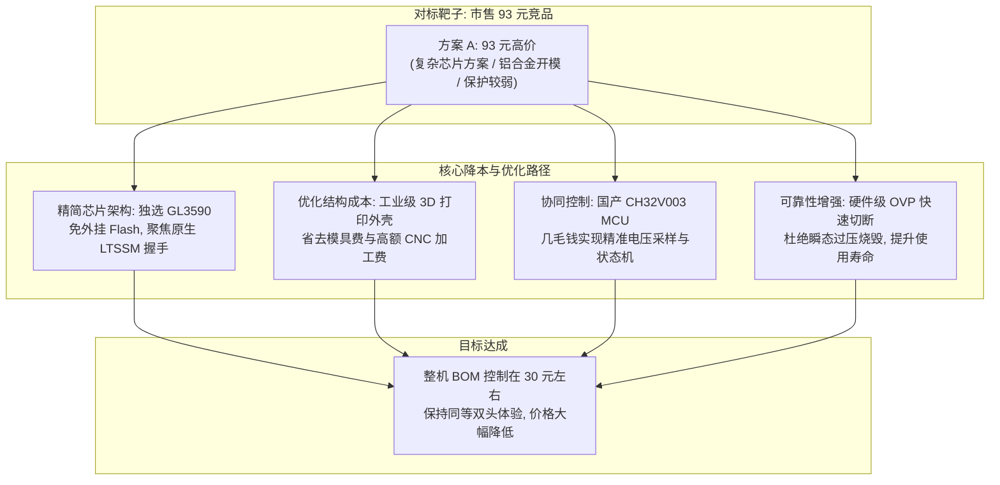

# USB 3.2 10G 接口测试器 - 竞品深度分析与降本突围战略 (Competitive Analysis)

| 文档版本 | 发布日期 | 作者 / 架构师 | 状态 | 适用阶段 |
| :--- | :--- | :--- | :--- | :--- |
| **V1.2** | 2026-10-09 | 硬件系统研发组 | 评审中 (In Review) | 产品规划与研发立项 |

---

## 1. 核心战略定位：直击市售 93 元竞品，全力把价格打下来！

在主板制造、整机组装与品质质检产线上，USB 3.2 Gen 2 (10Gbps) 接口需要快速测试工具。然而当前市场上能实现硬件测速握手的专用产品（方案 A，市售某款主流双头测试卡），电商终端售价高达 **93 元/台**。

对于配置数十个测试工位的工厂或维修网点而言，单台近百元的采购成本过高，批量部署负担较重。

**本项目的核心战略目标**：
> 主攻对标方案 A（市售 93 元双头产品），直击其价格昂贵的核心痛点。在维持相同 Type-A + Type-C 双头易用体验的前提下，通过“GL3590 原生精简架构 + 工业级 3D 打印外壳 + 国产单片机协同 + 硬件级 OVP 防护”，将整机硬件 BOM 成本严格控制在 **30 元左右**，相比方案 A 降幅达 65%~70%，用极致性价比打下市场！

---

## 2. 标杆竞品（市售 93 元产品）解构与成本居高原因剖析

对市售 93 元主流测试卡进行硬件与结构拆解分析，其价格居高不下主要源于以下因素：

### 2.1 芯片方案选型冗余，外围硬件成本偏高
- **方案 A 现状**：市售产品通常选用通用型存储桥接或多功能主控芯片，必须外挂大容量 SPI Flash 以及较为复杂的外围电源网络。
- **成本问题**：测试器的核心任务仅是完成 USB 物理层与链路层（LTSSM）的握手判定并输出状态，方案 A 选用的芯片架构包含了大量用不到的数据转发与存储控制单元，导致核心芯片及周边阻容成本较高。

### 2.2 外壳采用铝合金开模与 CNC 加工，结构成本沉重
- **方案 A 现状**：方案 A 采用传统铝合金型材开模，配合 CNC 倒角加工与阳极氧化工艺。
- **成本问题**：
  - 铝合金模具开发投入大；
  - 外壳单件加工费用高达 15~20 元，在整机成本中占比极大，直接推高了终端零售价格。

### 2.3 保护机制薄弱，耐用度受限
- **方案 A 现状**：内部缺乏主动硬件过压切断电路，仅依靠简易稳压元件吸收。一旦遇到母座瞬态浪涌或误接入异常电压，容易导致芯片损坏。

---

## 3. 对标方案 A：技术参数与 BOM 成本深度对比

### 3.1 核心技术与规格对阵表

| 对比维度 | 市售标杆竞品（方案 A） | 本自研项目（USB 3.2 10G 双头测试器） | 差异分析说明 |
| :--- | :--- | :--- | :--- |
| **终端采购价格** | **¥ 93.00 元** | **自制 BOM 成本约 30 元左右** | **核心差异：把价格打下来** |
| **物理接口形态** | Type-A + Type-C 双头集成 | Type-A + Type-C 双头集成 | 规格对齐，具备相同易用性 |
| **测试响应时间** | 1.0 ~ 3.0 秒 | ≤ 1.0 秒（即插即定论） | 判定响应迅速 |
| **Type-C 盲测能力** | 支持正反插 | 满针引出，支持正反插盲测 | 规格对齐 |
| **核心芯片架构** | 传统通用桥接方案（外围繁琐） | 选用 GL3590 原生 PHY 集线器架构 | 精简外围，专注协议握手 |
| **控制与电压采集** | 传统处理电路 | 国产 RISC-V CH32V003 (内置高速 ADC) | 低成本实现电压监控与 LED 驱动 |
| **过压保护机制** | 无主动切断 (遇高压易损坏) | 硬件级 OVP 快速切断 (响应时间 ≤100ns) | 异常电压自动隔离，保护主控 |
| **外壳与模具工艺** | 铝合金型材开模 + CNC | 工业级 3D 打印外壳 | 免除模具投入，显著降低结构成本 |

---

### 3.2 方案 A 预估成本 vs 自研测试器 BOM 拆解对比

| 成本拆解单元 | 方案 A 预估成本 (RMB) | 本自研测试器 BOM (RMB) | 降本实现路径 |
| :--- | :---: | :---: | :--- |
| **核心高速 PHY / 主控** | ¥ 20.00 ~ 25.00 | **¥ 12.00 ~ 14.00** | 选用成熟 GL3590，免外挂存储，精简电源管理 |
| **管家单片机 / 逻辑控制**| ¥ 3.00 ~ 5.00 | **¥ 0.80 ~ 1.00** | 采用国产低成本 RISC-V 单片机 CH32V003 |
| **保护与电源电路** | ¥ 1.50 ~ 2.00 | **¥ 2.00 ~ 2.50** | 增加分立式硬件 OVP 比较器与 P-MOS 关断电路 |
| **物理公头端子 (双头)** | ¥ 2.50 ~ 3.50 | **¥ 2.50 ~ 3.50** | 选用同等级工业级 Type-A 与满针 Type-C 公头 |
| **PCB 线路板 (4层板)** | ¥ 3.00 ~ 4.00 | **¥ 2.50 ~ 3.00** | 4 层 FR-4 高频阻抗控制，优化排版尺寸 |
| **阻容感 / TVS / LED** | ¥ 2.00 ~ 3.00 | **¥ 2.00 ~ 2.50** | 标准化元器件配置与低容 TVS 防护 |
| **外壳与结构件** | **¥ 15.00 ~ 20.00** (铝合金) | **¥ 2.00 ~ 3.00** (3D打印) | **采用工业级 3D 打印外壳，省去模具费与昂贵 CNC** |
| **辅料与组装包装** | ¥ 1.50 ~ 2.50 | **¥ 1.00 ~ 1.50** | 简易工业包装与标准装配流程 |
| **整机硬件 BOM 合计** | **¥ 48.50 ~ 65.00** | **¥ 25.80 ~ 31.00** | **整机成本稳定在 30 元左右，相比方案 A 降幅达 50%~60%** |
| **终端采购 / 销售价格** | **¥ 93.00 元** | **成本约 30 元，极具价格竞争力** | **打破 93 元的高价门槛** |

---

## 4. 把价格打下来的关键降本路径

### 4.1 路径一：精简芯片架构，选用成熟 GL3590
- GL3590 原生具备高速 USB 3.2 Gen 2 PHY 与链路层状态机，上电即可直接与主机发起并完成协议协商。
- 无需搭载高成本存储控制器与固件存储介质，外围线路精简，芯片端总成本明显优于方案 A 的通用方案。

### 4.2 路径二：采用工业级 3D 打印外壳，大幅削减结构成本
- 方案 A 外壳成本在总硬件成本中占比较大。
- 本项目采用工业级 3D 打印外壳（高韧性树脂或工程塑料），不仅免除模具开发费用，单件外壳成本也控制在 2~3 元内，有效拉低整体成本。

### 4.3 路径三：国产低成本 MCU 协同控制
- 引入国产 WCH CH32V003（单价不足 1 元）负责 ADC 母口供电监测与 4 色 LED 逻辑驱动，既保证了电压检测精度，又避免占用主控资源或引入昂贵的专用芯片。

### 4.4 路径四：增加硬件级 OVP 保护，提高治具耐用度
- 针对产线不良母座可能存在的瞬态过压或毛刺，加入硬件比较器与开关管组成的 OVP 快速切断电路（动作时间 ≤100ns）。
- 发生过压时及时切断后端供电并触发告警，有效避免治具因过压损坏，提升工具寿命。

---

## 5. 总结与后续推进重点

本次竞品分析明确了自研产品的方向：**保持与竞品一致的双头易用性体验，坚决把整机硬件成本降至 30 元左右**。

- 架构路线：锁定 GL3590 作为核心高速 PHY，搭配国产 CH32V003 单片机。
- 结构路线：采用工业级 3D 打印外壳，控制结构加工成本。
- 推进重点：在后续硬件设计中落实 4 层板高频阻抗控制及硬件 OVP 保护电路设计，确保低成本下的高可靠性与测试一致性。
