# USB 3.2 10G 接口测试器 - 项目研发路线图 (Project Roadmap)

| 文档版本 | 发布日期 | 作者 / 架构师 | 状态 | 适用阶段 |
| :--- | :--- | :--- | :--- | :--- |
| **V1.1** | 2026-10-09 | 硬件系统研发组 | 评审中 (In Review) | 项目规划与研发推进 |

---

## 1. 项目概述与核心目标 (Project Overview & Objectives)

### 1.1 项目技术基准
本项目为针对 PC 主板、整机产线及实验室快速检测场景打造的 **USB 3.2 Gen 2 (10Gbps) 双头极速接口测试器**。
- **核心芯片架构**：锁定创惟 **Genesys Logic GL3590** 原生 PHY 集线器方案作为 10G 握手核心；辅以国产 **WCH CH32V003** 32位 RISC-V 单片机作为管家 MCU。
- **物理接口形态**：原生集成 USB 3.0 Type-A 沉板公头与满针 USB Type-C 公头，支持双头即插即测与 Type-C 正反插盲测。
- **结构工艺方案**：采用**工业级 3D 打印外壳**（高韧性树脂/工程塑料），上下盖微卡扣装配，免去模具开发成本。
- **电气保护机制**：设计分立式硬件 OVP 快速切断电路（动作时间 ≤100ns，过压阈值 ~5.6V），防止产线瞬态过压击穿主控。
- **目标成本基线**：整机硬件 BOM 成本严格控制在 **30 元左右**（¥25.80 ~ 31.00），彻底打下市售 93 元竞品的价格壁垒。

### 1.2 阶段总览与关键里程碑节点
项目研发划分为五个标准阶段，以严谨的硬件工程评审门禁（Gate Review）驱动交付：

---

## 2. 研发阶段与关键里程碑详细规划 (Phases & Gate Reviews)

### 2.1 阶段零：概念与架构冻结阶段 (M0: Architecture & Spec Freeze)
- **核心目标**：完成技术规格书定稿、芯片选型锁定、BOM 成本模型核算与工程目录体系建立。
- **主要任务**：
  1. 完成并评审通过 PRD 文档及指示灯真值表定义；
  2. 完成市售 93 元竞品深度解构与 30 元降本路径落地分析；
  3. 冻结 GL3590 + CH32V003 核心拓扑、双头供电防倒灌机制与硬件 OVP 原理方案；
  4. 确定 4 层板高频阻抗层叠结构方案（JLC04161H / 常规 FR-4 90Ω 差分控制）。
- **门禁出线标准 (Gate 0 Exit Criteria)**：
  - PRD、竞品分析与系统设计方案通过内部工程评审；
  - 核心芯片 GL3590 及 CH32V003 采购渠道与封装确认无误；
  - 关键元器件选型清单完成度 100%。

---

### 2.2 阶段一：工程验证测试阶段 (M1: EVT - Engineering Validation Test)
- **核心目标**：完成原理图设计、PCB Layout、首批打样制板（5~10 套 PCBA），跑通电气供电与 10G/5G/480M 硬件握手逻辑。
- **主要任务**：
  1. **原理图设计 (EDA)**：完成 GL3590 最小系统、CH32V003 外围、OVP 比较器、双头输入与 4 颗 LED 电路设计；
  2. **PCB Layout 设计**：执行 4 层高频布线，严格控制 10G 差分对阻抗（90Ω ±10%）与内等长（时延差 < 1ps），布局优化控制在 60×18mm 尺寸内；
  3. **首版打样与贴片**：发板 4 层沉金打样，采购样片完成手贴/SMT 首版样机；
  4. **管家 MCU 初版固件**：编写 CH32V003 ADC 电压采样、状态机防抖与 4 色 LED 逻辑驱动；
  5. **基础功能调通**：验证 VBUS 自供电、OVP 过压触发切断动作，验证 GL3590 与 PC 主板的 LTSSM 协商点亮指示灯。
- **门禁出线标准 (Gate 1 Exit Criteria)**：
  - 首版 PCBA 具备自供电启动能力，无短路与异常发热；
  - OVP 保护电路在注入 >5.6V 时能准确实时切断；
  - 在标准 USB 3.2 10G 端口上成功握手并点亮 10G 绿色 LED。

---

### 2.3 阶段二：设计验证测试阶段 (M2: DVT - Design Validation Test)
- **核心目标**：针对 EVT 暴露问题实施改版优化（PCB V1.1），完成 3D 打印外壳结构匹配，执行全矩阵兼容性测试与可靠性验证。
- **主要任务**：
  1. **硬件设计优化 (V1.1 改版)**：根据首版高频走线与装配公差优化焊盘封装，加强 Type-C 公头结构固定脚抗剪切力；
  2. **3D 打印外壳建模与匹配**：使用工业级光敏树脂（SLA 8001/8200）打印上下盖卡扣外壳，微调卡扣阻尼与导光柱孔位；
  3. **主机兼容性矩阵测试**：覆盖 Intel 主板、AMD 主板、苹果 Mac 扩展坞、工控机等主流平台，验证正反插握手一致性；
  4. **可靠性初测**：执行高低温（-10℃ ~ +55℃）通电测试、连续插拔 500 次测试与瞬态浪涌过压拦截测试。
- **门禁出线标准 (Gate 2 Exit Criteria)**：
  - PCB V1.1 与 3D 打印外壳装配公差配合良好，外观与导光效果满足要求；
  - 主机兼容性测试矩阵通过率 100%（无假死、无异常掉速）；
  - 测试响应时间稳定在 ≤ 1.0 秒。

---

### 2.4 阶段三：生产验证测试阶段 (M3: PVT - Production Validation Test)
- **核心目标**：组织小批量试产（30~50 套），固化生产制造文件与测试作业指导书（SOP），验证直通率。
- **主要任务**：
  1. **制造资料固化**：输出量产 Gerber 光绘、SMT 激光钢网阶梯开孔文件、贴片机坐标文件（CPL）与结构 STL 生产文件；
  2. **编制作业文件**：编写《07_Mass_Production/02_SOP_Production.md》与《06_Testing_and_Validation/01_Test_Specification.md》；
  3. **装配与烧录流程验证**：验证 CH32V003 批量脱机烧录工装，测算装配与测试工时；
  4. **BOM 成本锁定核对**：根据小批量采购发票核实整机实际成本，确保锁定在 30 元左右预算区间。
- **门禁出线标准 (Gate 3 Exit Criteria)**：
  - 小批量试产 PCBA 贴片一次直通率 ≥ 96%；
  - 整机装配良率 ≥ 98%；
  - 生产与检验 SOP 齐备，作业员可独立操作。

---

### 2.5 阶段四：量产维护与工程发布阶段 (M4: MP - Mass Production)
- **核心目标**：正式量产归档，按需批量交付产线工位使用，持续跟踪使用反馈并维护工程变更通知（ECN）。
- **主要任务**：
  1. 工程全套资料归档封板（原理图 PDF、Gerber、BOM、代码与 STL）；
  2. 首批 100~200 套批量制作与产线工位分发部署；
  3. 建立售后维修与产线反馈追踪机制（Issue Log）。

---

## 3. 工作分解结构 (WBS - Work Breakdown Structure)

```mermaid
flowchart TD
    Project["USB 3.2 10G 测试器研发项目"]
    
    W1["1. 硬件工程 (HW)"]
    W2["2. 嵌入式固件 (FW)"]
    W3["3. 机械结构 (MD)"]
    W4["4. 测试验证 (QA)"]
    W5["5. 生产工程 (PE)"]

    Project --> W1
    Project --> W2
    Project --> W3
    Project --> W4
    Project --> W5

    W1 --> W11["1.1 原理图设计与审查"]
    W1 --> W12["1.2 4层板高频阻抗 Layout"]
    W1 --> W13["1.3 硬件 OVP 电路调校"]
    W1 --> W14["1.4 BOM 器件采购跟踪"]

    W2 --> W21["2.1 CH32V003 ADC 采集与滤波"]
    W2 --> W22["2.2 LED 状态机与真值表驱动"]
    W2 --> W23["2.3 异常消抖与看门狗逻辑"]

    W3 --> W31["3.1 3D 打印外壳 3D 建模"]
    W3 --> W32["3.2 上下盖卡扣结构优化"]
    W3 --> W33["3.3 批量打印公差验证"]

    W4 --> W41["4.1 硬件功能自测与调试"]
    W4 --> W42["4.2 主机兼容性矩阵测试"]
    W4 --> W43["4.3 OVP 浪涌与插拔可靠性测试"]

    W5 --> W51["5.1 SMT 光绘与坐标文件输出"]
    W5 --> W52["5.2 生产与检验 SOP 编写"]
    W5 --> W53["5.3 批量直通率分析与归档"]
```

---

## 4. 关键任务推进与交付矩阵 (Task Execution & Deliverables Matrix)

各阶段核心任务与关键交付物对应关系如下：

| 所属阶段 | 任务模块 | 具体工作事项 | 责任角色 | 里程碑输出物 |
| :--- | :--- | :--- | :--- | :--- |
| **M0 需求与架构** | 需求与架构 | PRD 完善、竞品分析与方案冻结 | 系统架构师 | PRD.md / 架构文档 |
| **M1 工程验证** | 硬件开发 | 原理图设计、阻抗计算、PCB Layout | 硬件工程师 | 原理图与 PCB 源文件 |
| **M1 工程验证** | 打样与制板 | 4层板制板打样、元器件采购备料 | 采购 / 硬件 | PCB 裸板与器件到位 |
| **M1 工程验证** | 固件开发 | CH32V003 驱动编写、状态机实现 | 固件工程师 | MCU 源码与固件 hex |
| **M1 工程验证** | EVT 验证 | 首版 PCBA 焊接、基本握手与 OVP 调测 | 硬件 / 固件 | EVT 测试记录与问题表 |
| **M2 设计验证** | 结构设计 | 3D打印外壳建模、打样试装、卡扣微调 | 结构工程师 | 3D STL 文件与实物外壳 |
| **M2 设计验证** | DVT 优化 | PCB V1.1 改版优化、装配整机 | 硬件工程师 | DVT 样机 (10~20套) |
| **M2 设计验证** | 兼容与可靠性 | 主板全覆盖测试、插拔与过压试验 | 测试工程师 | 兼容性测试报告 |
| **M3 生产验证** | PVT 试产 | 30~50 套试产、固化生产 SOP | PE / 生产组 | PVT 样机与标准 SOP |
| **M4 量产交付** | 量产交付 (MP) | 生产文件封板、批量分发、资料归档 | 研发项目组 | 全套工程量产文件归档 |

---

## 5. 项目风险管理与应对预案 (Risk Management & Mitigation)

| 风险类别 | 风险描述 | 潜在影响 | 预防措施与应急应对预案 |
| :--- | :--- | :--- | :--- |
| **高频信号风险** | PCB 差分阻抗控制偏差或走线不平衡，导致 10G 握手不稳定 | 握手偶发降级至 5G 或回退 | 选用大厂标准层叠（阻抗控制公差 ±10%）；严格等长控制（差分内误差 ≤5mil）；预留高频 AC 耦合电容焊盘与完整地参考平面。 |
| **外壳装配风险** | 3D 打印外壳因材料收缩公差造成卡扣过紧或松脱 | 外壳闭合不紧，影响体验 | 在 3D 模型中为卡扣与限位筋预留 0.15~0.2mm 单边装配间隙；采用尺寸稳定性较好的工业级高韧性 SLA 光敏树脂打样。 |
| **电气安全风险** | 被测端口瞬间浪涌电压冲击，导致主控芯片意外击穿 | 治具损坏，产线无法使用 | 采用硬件模拟比较器 + P-MOS 组合实现 ≤100ns 纳秒级主动过压关断；输入端布置低容值 TVS 防护静电与尖峰。 |
| **元器件供应与成本风险** | 核心芯片 GL3590 或公头端子价格波动导致整机 BOM 超标 | 无法达成 30 元目标 | 锁定现货常规包装料号；电阻电容选用通用 0402 现货料；与稳定供应商建立多通道供货渠道。 |

---

## 6. 研发交付物清单对照表 (Deliverables Checklist)

| 研发阶段 | 对应工程目录 | 核心交付物文件名称 | 交付标准 |
| :--- | :--- | :--- | :--- |
| **01 产品定义** | `01_Product_Definition/` | `01_PRD.md` `02_Competitive_Analysis.md` `03_Project_Roadmap.md` | 需求与指标全面固化，评审通过 |
| **02 系统方案** | `02_System_Design/` | `01_System_Architecture.md` `02_GL3590_Chip_Design.md` `04_Power_and_OVP_Design.md` | 原理可行性与引脚分配确定 |
| **03 硬件工程** | `03_Hardware_Design/` | 原理图 / 4层 PCB 源文件 生产 BOM 清单 3D 打印 STEP/STL 模型 | 满足高频 90Ω 阻抗与生产 DFM 规范 |
| **04 固件程序** | `04_Firmware_and_Configuration/`| CH32V003 源码工程 编译固件 hex 与烧录指南 | 状态机稳定工作，无死机复位 |
| **05 生产资料** | `05_Manufacturing_Files/` | 量产 Gerber / 钢网文件 / 坐标文件 | 工厂直接可用于贴片生产 |
| **06 测试验证** | `06_Testing_and_Validation/` | 测试操作规范 / 兼容性矩阵报告 | 全面验证各主流主机平台兼容性 |
| **07 量产支持** | `07_Mass_Production/` | 用户使用说明书 / 生产装配 SOP | 产线工人按手册即插即用 |
